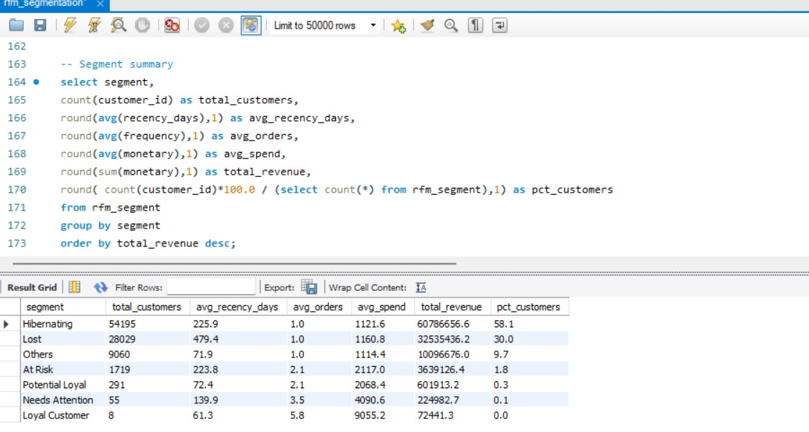
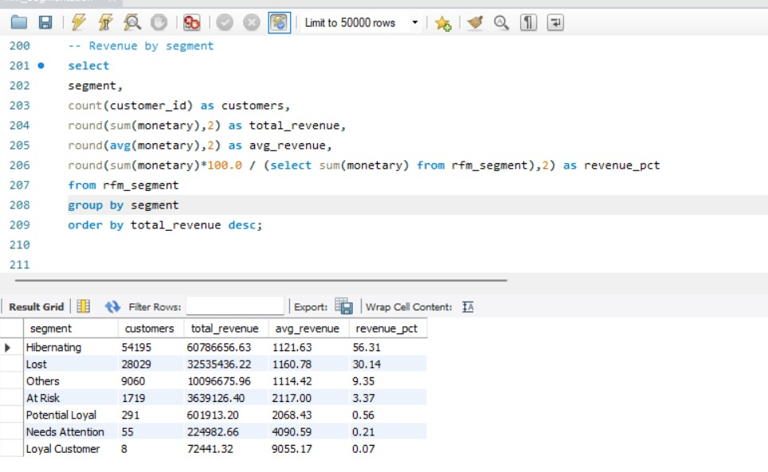
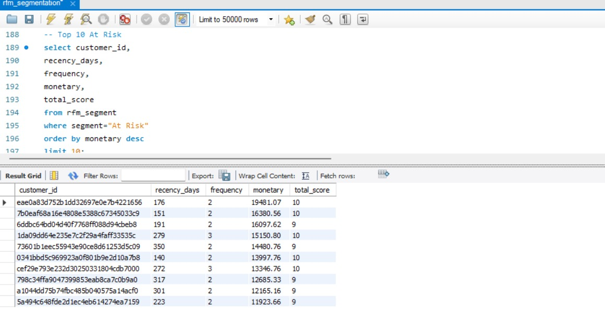
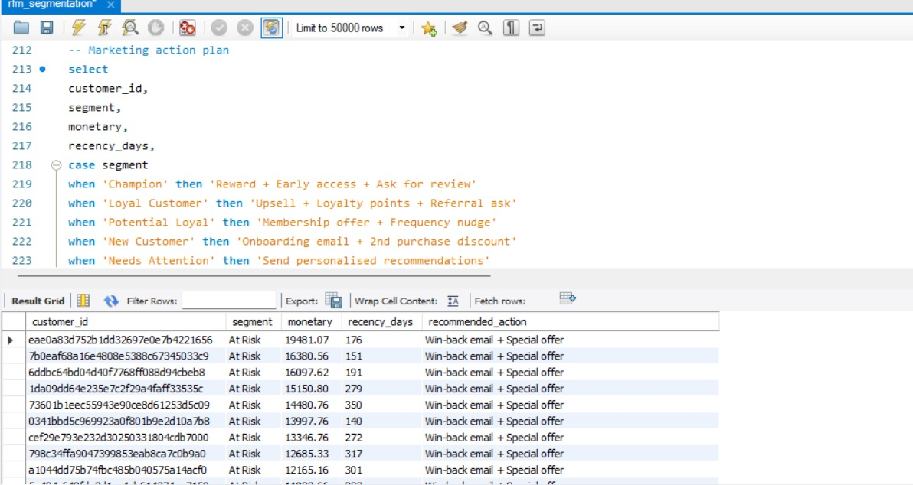

# E-Commerce Customer RFM Segmentation (SQL)

## Business Question
Which customers are our most valuable, who is at risk of churning,
and how should marketing prioritise outreach?

## Tools Used
- MySQL (Workbench)

## Dataset
Source: Kaggle — Brazilian E-Commerce Public Dataset by Olist
Link: https://www.kaggle.com/datasets/olistbr/brazilian-ecommerce
Size: 93,357 unique customers across 100,000+ orders
Key tables: olist_orders, olist_order_payments, olist_customers

## What I Built
- Created 4 relational tables and imported CSV data using LOAD DATA LOCAL INFILE
- Built SQL Views to calculate Recency, Frequency, and Monetary value per customer
- Scored each dimension 1–5 using CASE logic based on business thresholds
- Assigned 8 segment labels: Champion, Loyal Customer, Potential Loyal,
  New Customer, Needs Attention, At Risk, Hibernating, Lost
- Generated summary report with customer count, avg spend, and revenue per segment
- Mapped each segment to a recommended marketing action

## Key Findings
- Analysed 93,357 unique customers across delivered orders
- At-Risk segment = 1.8% of customers, contributing 3.4% of total revenue
- Champions identified as highest value customers for reward and retention
- Lost and Hibernating segments flagged for reactivation campaigns

## SQL File
rfm_segmentation.sql — contains all steps in one file:
  - Database and table creation
  - CSV import
  - RFM calculation
  - Scoring and segmentation
  - Summary reports and marketing action plan

## How to Run
1. Download Olist dataset from Kaggle
2. Extract CSV files to a local folder
3. Open MySQL Workbench
4. Run: SET GLOBAL local_infile = 1
5. Update the file path in LOAD DATA lines to your folder location
6. Run rfm_segmentation.sql from top to bottom

## Results

